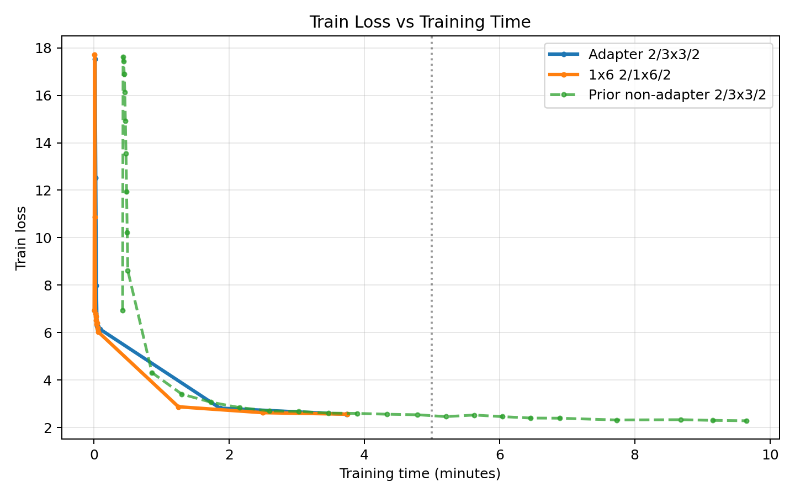
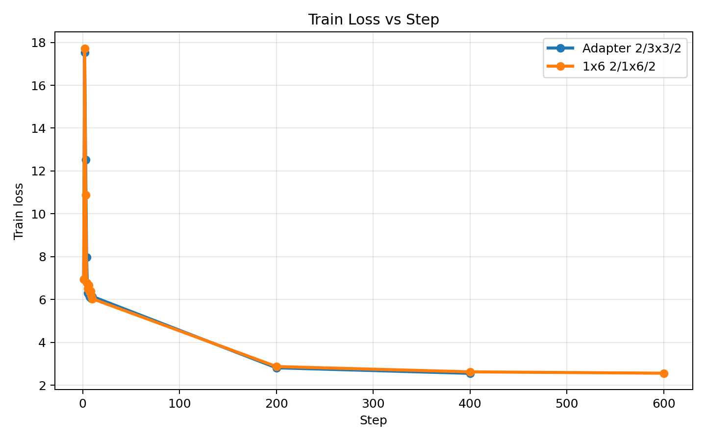
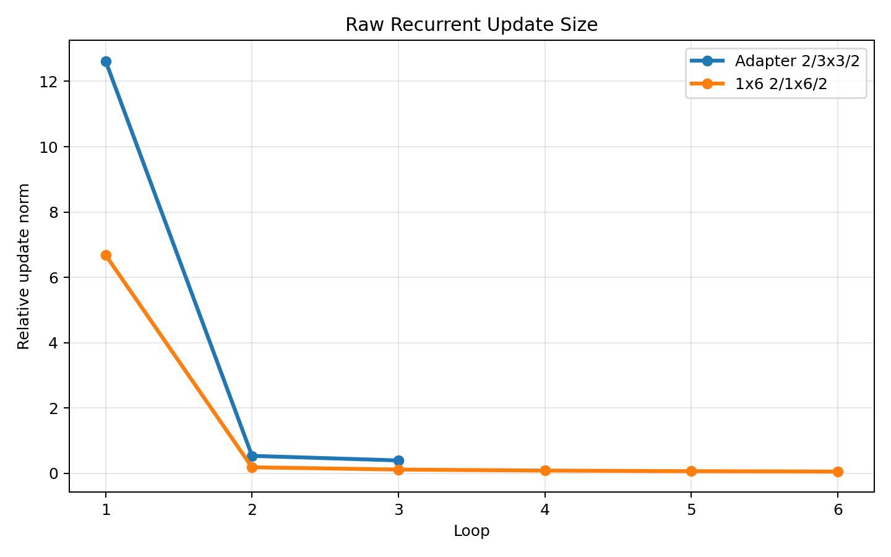
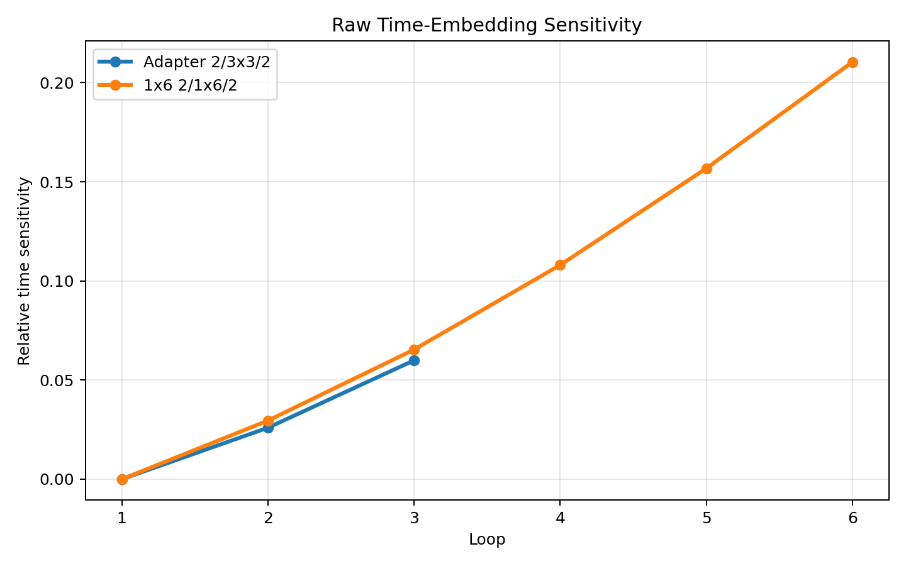
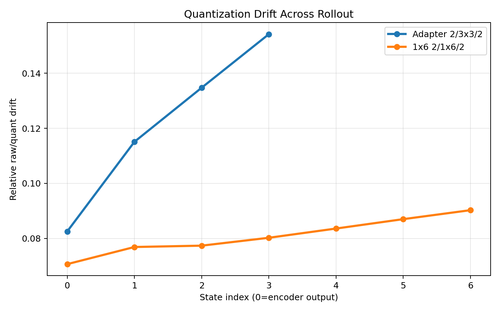
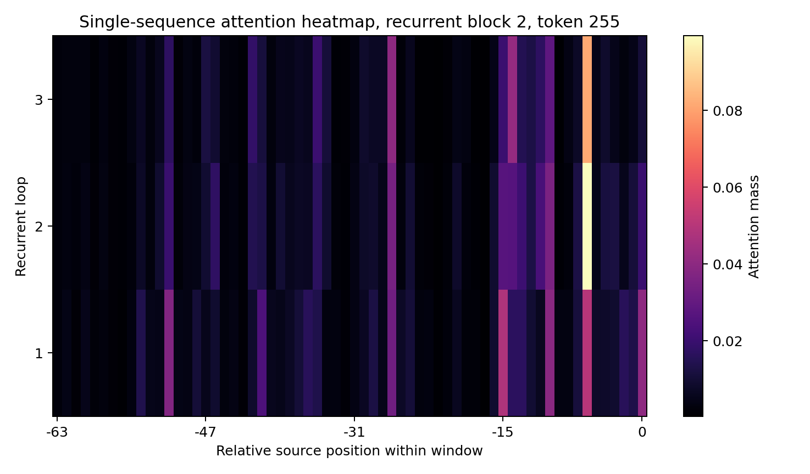
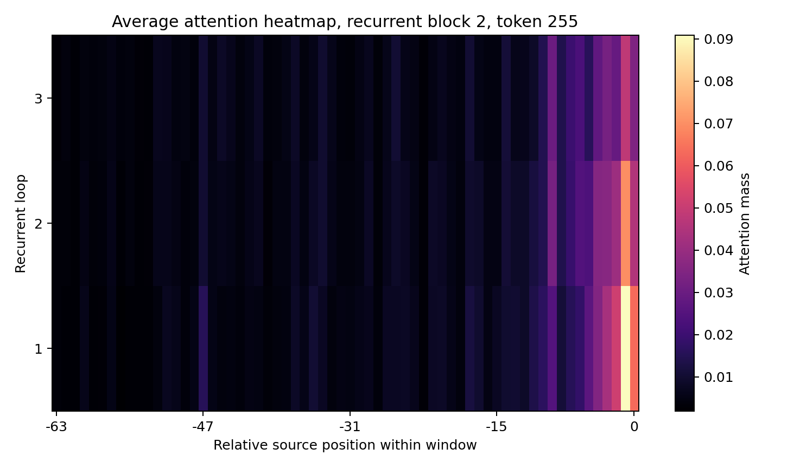
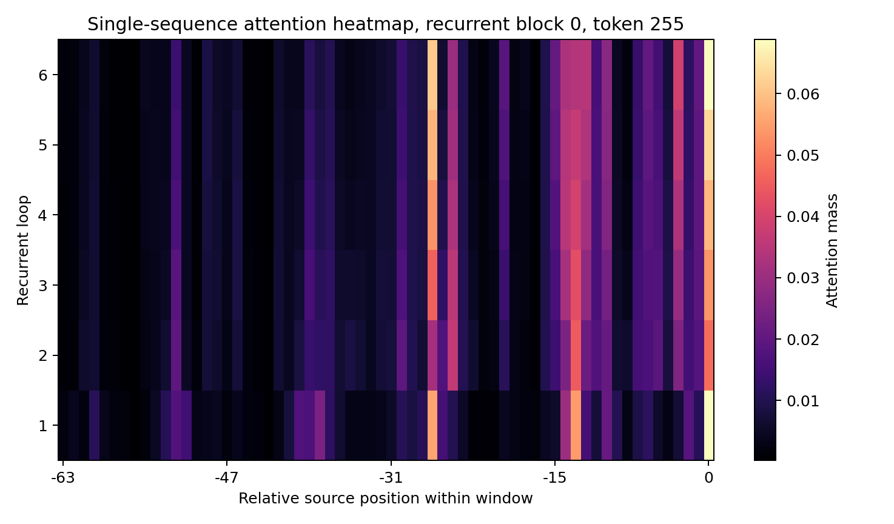
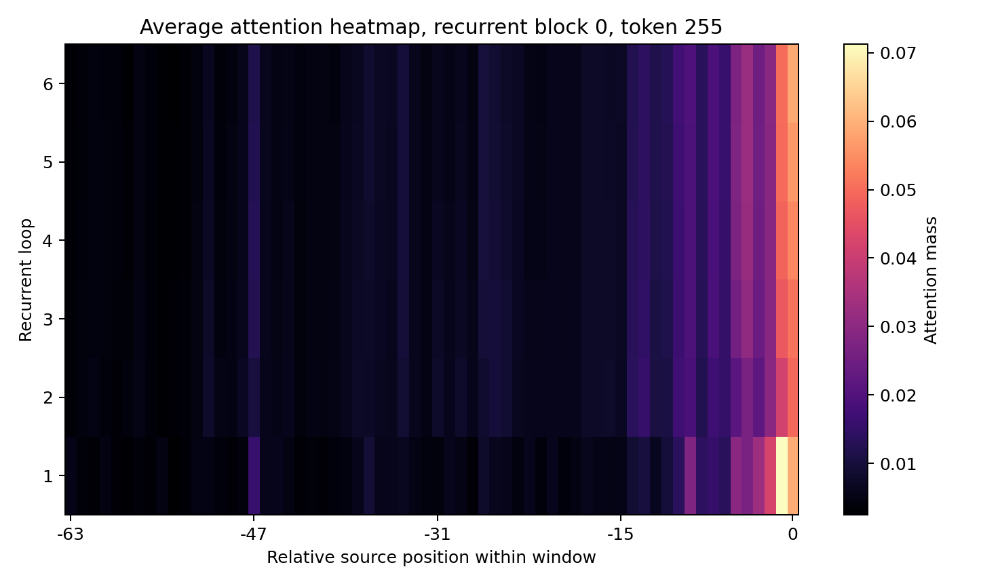

# Recurrent Adapter Bank vs 1x6 Geometry, 5-Minute H100 Runs

Goal: compare two ways of breaking the recurrent-depth degeneracy we had been seeing in loopformer-style runs.

- Run A: `2 / 3x3 / 2` with a PR325-style per-loop adapter bank
- Run B: `2 / 1x6 / 2` with no adapter bank

Both runs used:

- commit `bfa2d995325a9f9148f109a3a18677e1ab9de77a`
- `1x NVIDIA H100 80GB HBM3`
- `MAX_WALLCLOCK_SECONDS=300`
- doc-separated strided eval
- `USE_INT6=0`
- `QAT_ENABLED=0`

## Runs

| Run | ID | Result dir |
| --- | --- | --- |
| Adapter `2 / 3x3 / 2`, `RECURRENT_ADAPTER_DIM=64` | `20260402T184855Z_loopformer_2_3x3_2_adapter64_5min_20260402` | [raw](../.runpod/results/20260402T184855Z_loopformer_2_3x3_2_adapter64_5min_20260402) |
| `1x6` geometry `2 / 1x6 / 2` | `20260402T184915Z_loopformer_2_1x6_2_5min_20260402` | [raw](../.runpod/results/20260402T184915Z_loopformer_2_1x6_2_5min_20260402) |

## Main Read

- Both runs clearly broke the old exact-identity failure mode.
- The adapter-bank run produced large, nontrivial recurrent updates, but also much larger quantization drift across the rollout.
- The `1x6` run was much faster per step, completed full roundtrip eval, and looks more contractive and quantization-robust than the adapter-bank run.
- Relative to the older non-adapter `2 / 3x3 / 2` run, the adapter-bank run appears better by wall-clock at 5 minutes, but that comparison is partly an inference because the 5-minute adapter run was manually stopped during final eval and does not have a train-loss log exactly at `300s`.

## Training Curves

Combined plots:

- [Train loss vs training time](/Users/robertgordan/Projects/parameter-golf/experiment_summaries/assets/recurrent_adapter_vs_1x6_5min_20260402/train_loss_vs_time.png)
- [Train loss vs step](/Users/robertgordan/Projects/parameter-golf/experiment_summaries/assets/recurrent_adapter_vs_1x6_5min_20260402/train_loss_vs_step.png)

Key points from the curves:

- At equal step counts, the adapter-bank run is slightly ahead early:
  - step `200`: adapter `2.8125`, `1x6` `2.8710`
  - step `400`: adapter `2.5533`, `1x6` `2.6233`
- But `1x6` is far cheaper per step:
  - adapter: about `560.9 ms/step`
  - `1x6`: about `376.0 ms/step`
- At similar wall-clock time, the two are close in train loss:
  - adapter: step `400`, `train_loss 2.5533` at `224.355s`
  - `1x6`: step `600`, `train_loss 2.5599` at `225.071s`

So the adapter-bank run looks a bit stronger per update, while the `1x6` run is stronger per wall-clock second.

## Probe Results

Combined probe plots:

- [Raw recurrent update size](/Users/robertgordan/Projects/parameter-golf/experiment_summaries/assets/recurrent_adapter_vs_1x6_5min_20260402/probe_rel_update_norm.png)
- [Raw time-embedding sensitivity](/Users/robertgordan/Projects/parameter-golf/experiment_summaries/assets/recurrent_adapter_vs_1x6_5min_20260402/probe_time_sensitivity.png)
- [Quantization drift across rollout](/Users/robertgordan/Projects/parameter-golf/experiment_summaries/assets/recurrent_adapter_vs_1x6_5min_20260402/probe_quant_drift.png)

Per-run probe outputs:

- Adapter run:
  - [summary](assets/recurrent_block_probe_20260402T184855Z_loopformer_2_3x3_2_adapter64_5min_20260402/summary.json)
  - [rel update norm](assets/recurrent_block_probe_20260402T184855Z_loopformer_2_3x3_2_adapter64_5min_20260402/rel_update_norm.png)
  - [time sensitivity](assets/recurrent_block_probe_20260402T184855Z_loopformer_2_3x3_2_adapter64_5min_20260402/time_sensitivity_rel.png)
  - [quant drift](assets/recurrent_block_probe_20260402T184855Z_loopformer_2_3x3_2_adapter64_5min_20260402/raw_quant_rel_diff.png)
- `1x6` run:
  - [summary](assets/recurrent_block_probe_20260402T184915Z_loopformer_2_1x6_2_5min_20260402/summary.json)
  - [rel update norm](assets/recurrent_block_probe_20260402T184915Z_loopformer_2_1x6_2_5min_20260402/rel_update_norm.png)
  - [time sensitivity](assets/recurrent_block_probe_20260402T184915Z_loopformer_2_1x6_2_5min_20260402/time_sensitivity_rel.png)
  - [quant drift](assets/recurrent_block_probe_20260402T184915Z_loopformer_2_1x6_2_5min_20260402/raw_quant_rel_diff.png)
  - [single-position attention heatmap](assets/recurrent_block_probe_20260402T184915Z_loopformer_2_1x6_2_5min_20260402/attention_single_block0.png)
  - [average attention heatmap](assets/recurrent_block_probe_20260402T184915Z_loopformer_2_1x6_2_5min_20260402/attention_average_block0.png)

Reference recurrent probe:

- previous gate-init recurrent run, `4 / 3x3 / 4`, 186 steps:
  - [summary](assets/recurrent_block_probe_20260326T012005Z_smoketest_loopformer_2min_20260325/summary.json)

### Attention Heatmaps

These heatmaps show, for a fixed recurrent block, how attention over the last `64` source positions changes across recurrent loop iterations.

- x-axis: relative source position within the last-`64`-token window
- y-axis: recurrent loop iteration, with loop `1` at the bottom
- “single” view: one held-out validation sequence at the probed token position
- “average” view: mean over `8` validation probe batches

Block choice:

- adapter run: last recurrent block (`block 2`)
- `1x6` run: only recurrent block (`block 0`)

Adapter `2 / 3x3 / 2`, recurrent block `2`:

`1x6` `2 / 1x6 / 2`, recurrent block `0`:

### Raw recurrent rollout

| Metric | Loop | Adapter `2 / 3x3 / 2` | `1x6` `2 / 1x6 / 2` | Prev gate-init `4 / 3x3 / 4` |
| --- | --- | --- | --- | --- |
| rel_update_norm | 1 | `12.624` | `6.684` | `4.722` |
|  | 2 | `0.535` | `0.185` | `0.945` |
|  | 3 | `0.395` | `0.116` | `0.489` |
|  | 4 | — | `0.085` | — |
|  | 5 | — | `0.067` | — |
|  | 6 | — | `0.055` | — |
| cos_prev | 1 | `0.272` | `0.256` | `0.243` |
|  | 2 | `0.937` | `0.983` | `0.869` |
|  | 3 | `0.968` | `0.994` | `0.966` |
|  | 4 | — | `0.997` | — |
|  | 5 | — | `0.998` | — |
|  | 6 | — | `0.999` | — |
| cos_encoder | 1 | `0.272` | `0.256` | `0.243` |
|  | 2 | `0.236` | `0.253` | `0.108` |
|  | 3 | `0.203` | `0.248` | `0.046` |
|  | 4 | — | `0.244` | — |
|  | 5 | — | `0.240` | — |
|  | 6 | — | `0.237` | — |
| time_sensitivity | 1 | `0.000` | `0.000` | `0.000` |
|  | 2 | `0.026` | `0.030` | `0.016` |
|  | 3 | `0.060` | `0.065` | `0.035` |
|  | 4 | — | `0.108` | — |
|  | 5 | — | `0.157` | — |
|  | 6 | — | `0.210` | — |

### Quantized recurrent rollout

| Metric | Loop | Adapter `2 / 3x3 / 2` | `1x6` `2 / 1x6 / 2` | Prev gate-init `4 / 3x3 / 4` |
| --- | --- | --- | --- | --- |
| rel_update_norm | 1 | `12.514` | `6.836` | `4.735` |
|  | 2 | `0.526` | `0.193` | `0.942` |
|  | 3 | `0.390` | `0.120` | `0.502` |
|  | 4 | — | `0.088` | — |
|  | 5 | — | `0.070` | — |
|  | 6 | — | `0.058` | — |
| cos_prev | 1 | `0.275` | `0.253` | `0.229` |
|  | 2 | `0.939` | `0.981` | `0.873` |
|  | 3 | `0.969` | `0.994` | `0.966` |
|  | 4 | — | `0.997` | — |
|  | 5 | — | `0.998` | — |
|  | 6 | — | `0.999` | — |
| cos_encoder | 1 | `0.275` | `0.253` | `0.229` |
|  | 2 | `0.240` | `0.250` | `0.102` |
|  | 3 | `0.208` | `0.245` | `0.044` |
|  | 4 | — | `0.240` | — |
|  | 5 | — | `0.236` | — |
|  | 6 | — | `0.233` | — |
| time_sensitivity | 1 | `0.000` | `0.000` | `0.000` |
|  | 2 | `0.025` | `0.029` | `0.018` |
|  | 3 | `0.059` | `0.065` | `0.038` |
|  | 4 | — | `0.107` | — |
|  | 5 | — | `0.155` | — |
|  | 6 | — | `0.208` | — |

### Raw vs Quantized Drift

| State | Adapter rel_diff | Adapter cos(raw, quant) | `1x6` rel_diff | `1x6` cos(raw, quant) | Prev gate-init rel_diff | Prev gate-init cos(raw, quant) |
| --- | --- | --- | --- | --- | --- | --- |
| encoder | `0.0825` | `0.9966` | `0.0707` | `0.9975` | `0.0669` | `0.9977` |
| after loop 1 | `0.1151` | `0.9931` | `0.0769` | `0.9973` | `0.5829` | `0.8269` |
| after loop 2 | `0.1347` | `0.9910` | `0.0774` | `0.9973` | `0.6509` | `0.7833` |
| after loop 3 | `0.1542` | `0.9884` | `0.0802` | `0.9971` | `0.7170` | `0.7411` |
| after loop 4 | — | — | `0.0836` | `0.9969` | — | — |
| after loop 5 | — | — | `0.0870` | `0.9967` | — | — |
| after loop 6 | — | — | `0.0903` | `0.9965` | — | — |

### `adaLN_modulation` Norms

| Tensor | Adapter `2 / 3x3 / 2` | `1x6` `2 / 1x6 / 2` |
| --- | --- | --- |
| `recurrent_blocks.0.adaLN_modulation.1.weight` | `83.70` | `139.29` |
| `recurrent_blocks.0.adaLN_modulation.1.bias` | `3.60` | `3.97` |
| `recurrent_blocks.1.adaLN_modulation.1.weight` | `127.32` | — |
| `recurrent_blocks.1.adaLN_modulation.1.bias` | `5.46` | — |
| `recurrent_blocks.2.adaLN_modulation.1.weight` | `128.47` | — |
| `recurrent_blocks.2.adaLN_modulation.1.bias` | `5.69` | — |

### Probe Read

- The reference “good recurrent” gate-init run is useful mainly as a sanity baseline: it was active and non-degenerate, but it had severe quantization collapse by loop 3.
- Both runs are clearly off the old dead-identity path: updates are nonzero, time sensitivity is nonzero after loop 1, and `adaLN_modulation` norms are far from zero.
- The adapter-bank run is much more aggressive:
  - first-loop update norm `12.624`
  - drift grows from `0.0825` at the encoder state to `0.1542` by loop 3
- The `1x6` run is much more contractive:
  - update norms decay smoothly `6.684 -> 0.185 -> 0.116 -> ... -> 0.055`
  - drift stays low and grows slowly `0.0707 -> 0.0903` through loop 6
- Relative to the prior gate-init recurrent result, both new runs are dramatically more quantization-stable:
  - prior loop-3 drift: `0.7170`, cosine `0.7411`
  - adapter loop-3 drift: `0.1542`, cosine `0.9884`
  - `1x6` loop-3 drift: `0.0802`, cosine `0.9971`
- So the adapter bank does fix identity recurrence, but `1x6` currently looks cleaner and more quantization-robust.

## 5-Minute Comparison Against Prior Non-Adapter `2 / 3x3 / 2`

Reference run:

- [previous non-adapter `2 / 3x3 / 2` 10-minute run](/Users/robertgordan/Projects/parameter-golf/.runpod/results/20260326T150828Z_loopformer_2_3x3_2_curriculum234_10min_20260325)
- [previous non-adapter `2 / 3x3 / 2` 10-minute run](../.runpod/results/20260326T150828Z_loopformer_2_3x3_2_curriculum234_10min_20260325)

At exactly `300s` of training time:

- prior non-adapter `2 / 3x3 / 2`
  - interpolated train loss: `2.4949`
- adapter-bank `2 / 3x3 / 2`
  - nearest logged train point before stop: `2.5533` at `224.355s`
  - stop-time pre-quant val: `2.4431` at `300.408s`
  - linearly extrapolated train loss to `300s`: about `2.3788`

Important caveat:

- the adapter run does not log a train-loss point exactly at `300s`
- so `2.3788` is an inference from the slope between the `200`-step and `400`-step training logs
- the hard measured number at the 5-minute wallclock stop is the pre-quant validation loss `2.4431`, not a train loss

Even with that caveat, the direction looks favorable for adapters on this specific comparison:

- the prior non-adapter `2 / 3x3 / 2` run looked weaker by wall-clock at 5 minutes
- but the new `1x6` run still looks like the cleaner overall direction because it combines:
  - much better throughput
  - clearly non-degenerate recurrent behavior
  - smaller quantization drift
  - a completed final eval

## Run Metrics

| Metric | Adapter `2 / 3x3 / 2` | `1x6` `2 / 1x6 / 2` |
| --- | --- | --- |
| stop step | `535` | `798` |
| last logged train step | `400` | `600` |
| last logged train loss | `2.5533` | `2.5599` |
| stop-time pre-quant val loss | `2.4431` | `2.4004` |
| stop-time pre-quant val bpb | `1.4469` | `1.4217` |
| final roundtrip val loss | unavailable, run manually cut during eval after salvage | `2.40910400` |
| final roundtrip val bpb | unavailable, run manually cut during eval after salvage | `1.42680709` |
| average step time at stop | `561.51 ms` | `375.96 ms` |
| peak memory allocated | `16712 MiB` | `11415 MiB` |
| `final_model.pt` bytes | `69,067,871` | `43,587,122` |
| `final_model.int8.ptz` bytes | `11,628,433` | `7,946,967` |

## Bottom Line

- The adapter bank does fix the earlier exact-identity failure mode.
- But the resulting recurrent process is much less contractive and much more quantization-sensitive than the `1x6` shared-block geometry.
- The `1x6` run is currently the stronger systems result:
  - faster
  - smaller
  - lower pre-quant and post-quant BPB
  - lower rollout drift
  - stronger time sensitivity across depth
