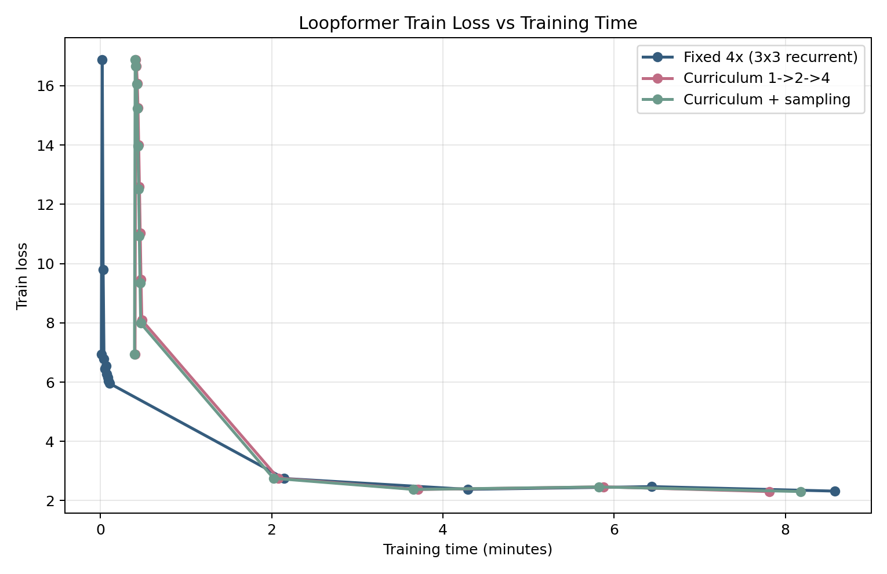
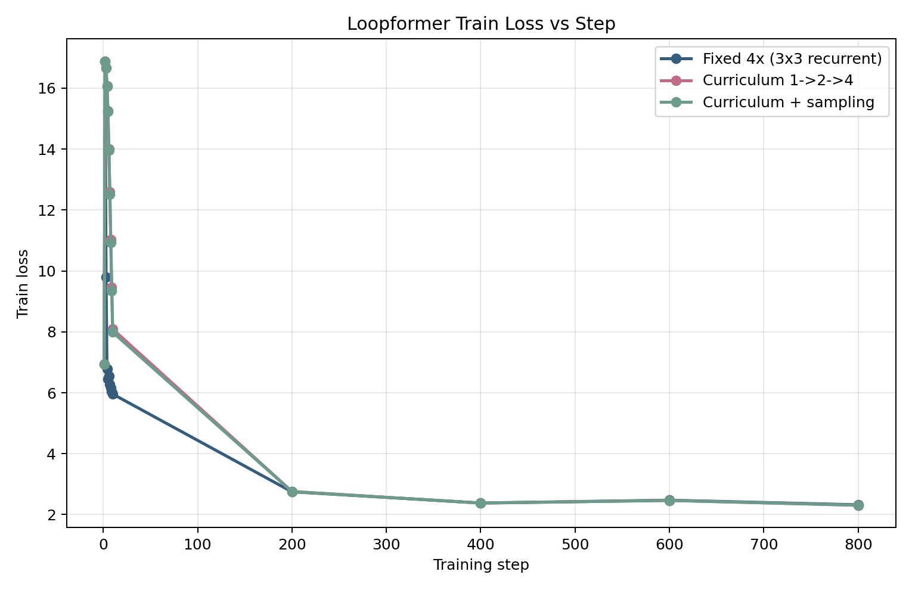
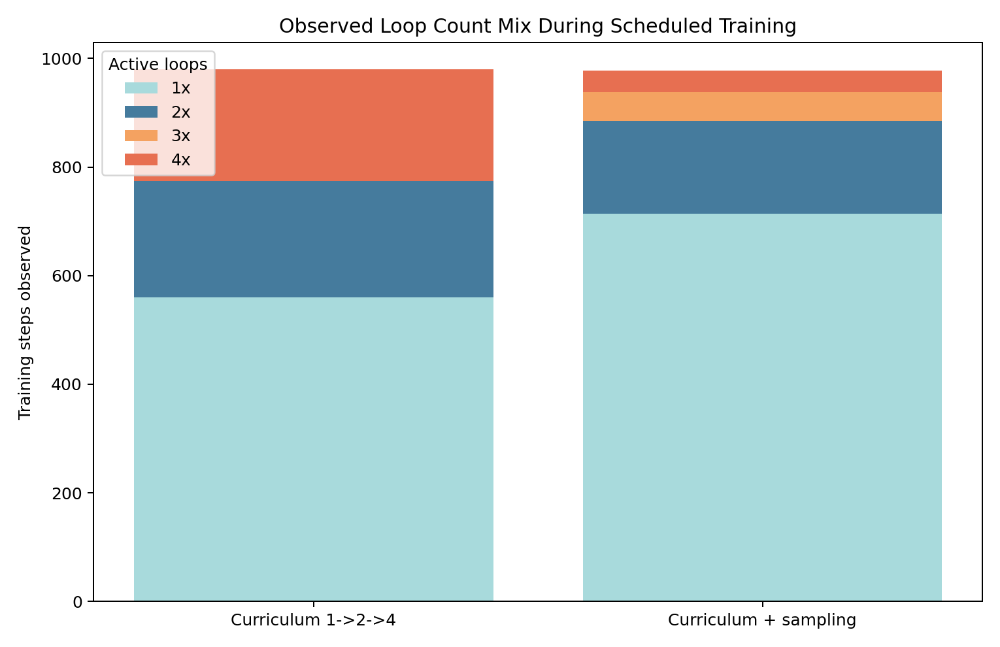

# Recurrent Loop Schedule / Sampling 10-Minute Runs

Goal: compare two train-time recurrent-depth strategies on the same loopformer-style recurrent model under the standard `1x H100` 10-minute budget:

1. curriculum only: first 50% at `1x`, next 25% at `2x`, final 25% at `4x`
2. the same curriculum, but sample the active loop count per batch from the currently allowed set

The motivating question was whether shallower train-time recurrence could recover tokens seen and step count relative to the earlier fixed-depth recurrent runs.

## Important Caveat

These two new runs accidentally used the flat validation path, not the doc-separated strided eval path used by the earlier fixed-depth loopformer control in [loopformer_quant_compare_20260324.md](/Users/robertgordan/Projects/parameter-golf/experiment_summaries/loopformer_quant_compare_20260324.md).

That means:
- throughput / steps / tokens seen comparisons against the fixed-depth control are valid
- train-loss curve comparisons against the fixed-depth control are valid
- direct `val_bpb` comparisons against the earlier fixed-depth control are **not** apples-to-apples
- the two new runs are still directly comparable to each other, because they used the same eval configuration

## Shared Setup

- Commit: `f498660bf426ab622c492a36847f327735cc2f4c`
- GPU: `1x NVIDIA H100 80GB HBM3`
- Cloud: `SECURE`
- Dataset: FineWeb `fineweb10B_sp1024`
- Train shards: `80`
- Validation tokens: `62,021,632`
- Train batch tokens: `524,288`
- Train sequence length: `1024`
- Iterations cap: `20,000`
- Wallclock cap: `600s`
- Warmup steps: `20`
- Quantization: `int8+zlib`
- Model shape:
  - encoder layers: `4`
  - recurrent layers: `3`
  - recurrent loops: `4`
  - decoder layers: `4`
  - parameters: `24,274,008`

## Runs

### Curriculum Only

- Run ID: `20260325T033817Z_loopformer_recur_4_3x4_4_10min_curriculum_20260324`
- Raw artifacts: [`.runpod/results/20260325T033817Z_loopformer_recur_4_3x4_4_10min_curriculum_20260324`](/Users/robertgordan/Projects/parameter-golf/.runpod/results/20260325T033817Z_loopformer_recur_4_3x4_4_10min_curriculum_20260324)
- Schedule mode: `auto`  
  Practical effect in this run:
  - `1x` until about step `560`
  - `2x` until about step `774`
  - `4x` until stop at step `980`

Metrics:
- Last logged train step: `800`
- Last logged train loss: `2.3062`
- Stop step / main eval step: `980`
- Train tokens seen: `980 * 524,288 = 513,802,240`
- Main eval loss: `2.2960`
- Main eval BPB: `1.3598`
- Roundtrip eval loss: `2.29866418`
- Roundtrip eval BPB: `1.36139841`
- Quantization penalty: `+0.00159841 BPB`
- Train time to main eval: `600,255 ms`
- Average step time at stop: `612.51 ms`
- Final eval time: `23,630 ms`
- Elapsed wall time: `804.898 s`
- Peak memory allocated: `22,471 MiB`
- Peak memory reserved: `22,558 MiB`
- Compressed model bytes: `13,131,149`
- Compressed total submission bytes: `13,204,390`

Recovered train-loss breakdown by active loops:
- `1x(loss=3.1491,n=560)`
- `2x(loss=2.3820,n=214)`
- `4x(loss=2.3161,n=206)`

### Curriculum + Sampling

- Run ID: `20260325T033843Z_loopformer_recur_4_3x4_4_10min_curriculum_sample_20260324`
- Raw artifacts: [`.runpod/results/20260325T033843Z_loopformer_recur_4_3x4_4_10min_curriculum_sample_20260324`](/Users/robertgordan/Projects/parameter-golf/.runpod/results/20260325T033843Z_loopformer_recur_4_3x4_4_10min_curriculum_sample_20260324)
- Schedule mode: `auto`
- Sampling choices: `1,2,3,4`

Metrics:
- Last logged train step: `800`
- Last logged train loss: `2.3073`
- Stop step / main eval step: `978`
- Train tokens seen: `978 * 524,288 = 512,753,664`
- Main eval loss: `2.2969`
- Main eval BPB: `1.3603`
- Roundtrip eval loss: `2.29919508`
- Roundtrip eval BPB: `1.36171284`
- Quantization penalty: `+0.00141284 BPB`
- Train time to main eval: `600,226 ms`
- Average step time at stop: `613.73 ms`
- Final eval time: `23,677 ms`
- Elapsed wall time: `801.678 s`
- Peak memory allocated: `22,471 MiB`
- Peak memory reserved: `22,558 MiB`
- Compressed model bytes: `13,182,566`
- Compressed total submission bytes: `13,255,807`

Recovered train-loss breakdown by active loops:
- `1x(loss=2.9733,n=714)`
- `2x(loss=2.3567,n=171)`
- `3x(loss=2.3079,n=53)`
- `4x(loss=2.3141,n=40)`

### Earlier Fixed-Depth Control

This is the closest prior control on the same general model family, but it is **not** directly comparable on `val_bpb` because it used strided/doc-separated eval.

- Run ID: `20260324T232001Z_loopformer_recur_4_3x3_4_int8_h100_10min_20260324`
- Raw artifacts: [`.runpod/results/20260324T232001Z_loopformer_recur_4_3x3_4_int8_h100_10min_20260324`](/Users/robertgordan/Projects/parameter-golf/.runpod/results/20260324T232001Z_loopformer_recur_4_3x3_4_int8_h100_10min_20260324)
- Commit: `b80a49baddd031e0d5de7d53aea30935bbf4d7e0`
- Validation config:
  - `EVAL_STRIDED_ATTN=1`
  - `EVAL_DOC_SEPARATED=1`

Metrics:
- Parameters: `24,274,008`
- Stop step / main eval step: `934`
- Train tokens seen: `934 * 524,288 = 489,684,992`
- Last train loss at step `800`: `2.3224`
- Main eval BPB: `1.3427`
- Roundtrip eval BPB: `1.34495199`
- Average step time at stop: `643.01 ms`
- Final eval time: `527,465 ms`
- Peak memory allocated: `19,414 MiB`
- Peak memory reserved: `19,436 MiB`
- Compressed model bytes: `12,929,416`
- Compressed total submission bytes: `12,995,921`

## Plots

Train loss vs training time:

Train loss vs step:

Observed loop-count mix in the two scheduled runs:

## Results

### 1. The schedule did increase training throughput relative to the earlier fixed-depth recurrent control.

Compared with the earlier fixed `3x3` recurrent int8 run:
- curriculum-only gained `46` steps: `980 vs 934`
- curriculum+sampling gained `44` steps: `978 vs 934`
- curriculum-only gained `24,117,248` train tokens
- curriculum+sampling gained `23,068,672` train tokens

That is only about a `5%` improvement in steps/tokens, but it is real.

### 2. Sampling did not improve throughput relative to plain curriculum.

The two new runs are essentially tied:
- curriculum-only stop step: `980`
- sampling stop step: `978`
- curriculum-only step average: `612.51 ms`
- sampling step average: `613.73 ms`

So the lower observed GPU utilization on the sampled run was not translating into more useful training throughput.

### 3. Train loss at matched step counts is very close across all three runs.

From the plotted curves and logs:
- at step `200`, all three runs are around `2.75-2.76`
- at step `400`, all three are around `2.376-2.379`
- at step `800`, all three are around `2.306-2.322`

So the schedule changes mainly affect how much compute is spent per step and how many steps fit in the wallclock budget, not obvious per-step optimization quality.

### 4. The sampled run spent most of its training budget at `1x` anyway.

Recovered loop exposures:
- curriculum-only: `560 @ 1x`, `214 @ 2x`, `206 @ 4x`
- sampling: `714 @ 1x`, `171 @ 2x`, `53 @ 3x`, `40 @ 4x`

Even with much more shallow-loop exposure, the sampled run did not materially outpace the simpler curriculum run.

### 5. The BPB comparison to the older fixed-depth control is contaminated by the eval-path mismatch.

The new runs used the flat eval path by mistake, which is why:
- their final eval time is only about `23.6s`
- the old fixed-depth run’s final eval time was `527.5s`

That means:
- `1.3614 / 1.3617` from the new runs
- versus `1.3450` from the old fixed-depth control

cannot be interpreted as “the new training strategy is worse,” because the evaluation definitions differ.

The meaningful BPB comparison from this experiment is only:
- curriculum-only vs curriculum+sampling

On that comparison, curriculum-only is slightly better:
- pre-quant: `1.3598` vs `1.3603`
- post-quant: `1.36139841` vs `1.36171284`

## Interpretation

The scheduled-depth idea is directionally promising for throughput, but the gain is modest in its current form.

What it seems to buy:
- about `5%` more steps / train tokens than the earlier fixed-depth recurrent run
- similar or slightly better train loss at matched wallclock

What it does **not** seem to buy:
- a clear advantage from per-batch random loop sampling
- anything close to non-recurrent baseline throughput

The current sampling variant is especially informative:
- it spends much more of training on `1x`
- but still does not outrun plain curriculum
- which suggests the fixed per-step overheads and runtime variability are eating a lot of the theoretical savings

## Conclusion

Within this experiment:
- curriculum-only beat curriculum+sampling very slightly
- both beat the earlier fixed-depth recurrent control on raw steps/tokens seen
- but only by a small margin

The clean next step is:
- rerun the better curriculum-only configuration with `EVAL_STRIDED_ATTN=1` and `EVAL_DOC_SEPARATED=1`

That is the only way to make a trustworthy BPB comparison against the earlier loopformer recurrent runs.
